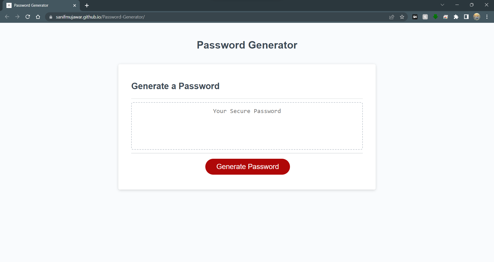

# 🎉 Password Generator 🎉

## Overview

Welcome to the Password Generator project! 🚀 In this challenge, you will be creating an application that allows users to generate a random password based on their specified criteria. The application will run in the browser and feature dynamically updated HTML and CSS powered by JavaScript code.

The password can include special characters, and users will be prompted to choose the length of the password and the character types they want to include (lowercase, uppercase, numeric, and special characters).

## Instructions 📝

To use the Password Generator:

1. Open the [Password Generator](https://sanifmujawar.github.io/Password-Generator/) in your web browser. 🌐
2. Click the "Generate Password" button to start the process. 🔄
3. A series of prompts will appear asking for your preferred password criteria:
   - Length of password: Enter a number between 8 and 128 to specify the length of the password.
   - Character types: Choose at least one of the following character types by clicking "OK" for yes and "Cancel" for no:
     - Lowercase letters
     - Uppercase letters
     - Numeric characters
     - Special characters (e.g., $, @, %, &, *, etc.) 💡
4. After confirming your desired criteria, the password will be generated and displayed in the "Your Secure Password" textarea. 🔒

Please ensure that at least one character type is selected; otherwise, the password generation will not proceed. ⚠️

## Website Screenshot 📸

## Technical Acceptance Criteria 🛠️

- The application should generate a password based on the user's selected criteria and display it correctly. ✔️
- The application should validate user inputs and ensure that at least one character type is chosen. ✔️
- There should be no errors displayed in the browser console when inspecting the application using Chrome DevTools. 🐞

## Deployment 🚀

The Password Generator is deployed and accessible via the following URL: [Password Generator](https://sanifmujawar.github.io/Password-Generator/). 🌐

The project's source code is available on GitHub: [GitHub Repository](https://github.com/sanifmujawar/Password-Generator). 💻

## Application Quality 🌟

The Password Generator provides an intuitive user experience, making it easy to navigate and understand. The user interface style is clean, polished, and resembles the mock-up functionality provided in the challenge instructions. ✨

## Repository Quality 📚

The GitHub repository for this project follows best practices for file structure, naming conventions, class/id naming, indentation, and includes descriptive commit messages. It also contains a quality README file with a project description, a screenshot of the application, and a link to the deployed application. 📝

---

© 2023 [Sanif Mujawar](https://github.com/sanifmujawar) Confidential and Proprietary. All Rights Reserved.

🏆 Note: You may add additional sections or details to the README depending on the project's requirements and complexity. 📋